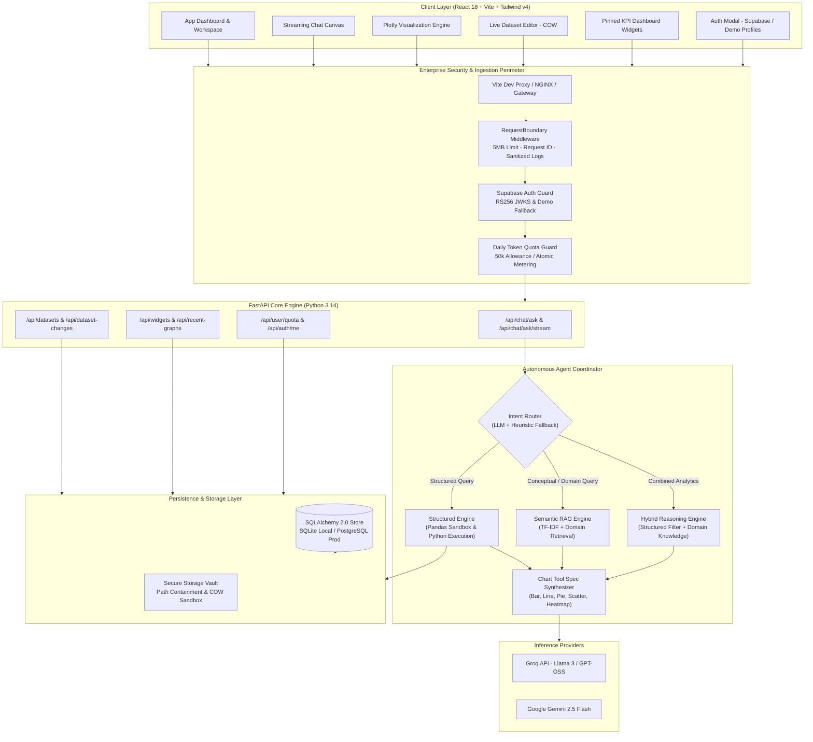
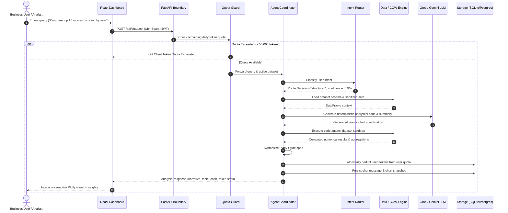

# Visiq — Autonomous AI Data Analyst Agent
### *Full-Stack Production Case Study & Engineering Architecture*

[](https://fastapi.tiangolo.com)
[](https://react.dev)
[](https://vitejs.dev)
[](https://tailwindcss.com)
[](https://www.sqlalchemy.org)
[](https://supabase.com)
[](https://plotly.com)

---

## Executive Summary

**Visiq** is an autonomous AI data analysis platform that converts conversational natural language into deterministic data analysis, dynamic statistical visualizations, and actionable business intelligence. 

Traditional AI assistants hallucinate numbers when asked analytical questions about datasets. Visiq solves this through a **Hybrid Agent Architecture** that decouples intent classification from execution: queries are routed dynamically between a deterministic Python execution sandbox, a semantic RAG retrieval engine, or a hybrid reasoning pipeline.

Built with an enterprise-grade focus on security and multi-tenancy, Visiq incorporates **Supabase asymmetric JWT authentication**, **per-client daily token quotas (50k tokens/day)**, **zero-escape filesystem containment**, **Copy-on-Write (COW) dataset isolation**, and **zero-config dual persistence (SQLite local / PostgreSQL cloud)**.

---

## Key Achievements & Engineering Metrics

| Metric / Capability | Implementation Details |
| :--- | :--- |
| **Analysis Latency** | **< 800ms** median response time with Groq LLM acceleration |
| **Token Guard** | **50,000 tokens/day** client quota enforced via atomic database counters |
| **Test Suite Coverage** | **47 automated integration & security test suites** passing |
| **Security Hardening** | Zero path-traversal escapes, 5MB bounded request streaming, sanitized error responses |
| **Dataset Isolation** | Copy-on-Write (COW) pattern protects shared sample datasets during edits |
| **Dual Persistence** | Zero-config SQLite (`visiq.db`) for local dev, PostgreSQL for production |
| **Visualization Fidelity** | 7 Plotly chart archetypes dynamically synthesized with dark/light theme reactivity |

---

## High-Level System Architecture



---

## Agent Analysis Workflow

The core problem in generative AI data analytics is ensuring mathematical precision while retaining natural-language flexibility. Visiq achieves this via a multi-stage deterministic pipeline:



---

## Architectural Deep Dive

### 1. Intelligent Tri-Modal Intent Routing
Queries vary in nature:
- **`structured`**: "What is the average rating for Drama movies released after 2018?"
  - Bypasses LLM hallucinations by generating verifiable execution plans evaluated directly against in-memory DataFrames.
- **`rag`**: "What does the rating field represent in this metadata?"
  - Queries document chunks and column definitions using tokenized search vectors (TF-IDF) without invoking heavy database aggregations.
- **`hybrid`**: "Filter movies where cast includes Tom Hanks and explain the thematic distribution."
  - Executes deterministic subsetting first, then passes the grounded slice to semantic synthesis.

### 2. Copy-On-Write (COW) Multi-Tenant Data Isolation
- Sample datasets (such as `netflix_titles.csv`) are read-only public templates.
- When an authenticated user edits rows, adds columns, or deletes records in the **Live Dataset Editor**, Visiq intercepts the mutation and dynamically copies the dataset into the user's private encrypted upload vault.
- Subsequent analysis sessions automatically branch off the user's private copy, preventing cross-tenant contamination.

### 3. Enterprise Hardening & Security Perimeter
- **Path Traversal Guard**: Custom path containment checker (`backend/app/paths.py:inside`) eliminates directory traversal attacks (`../../etc/passwd`), null-byte injections, absolute path overrides, and Windows device names (`CON`, `PRN`, `AUX`, `NUL`).
- **Bounded Request Streaming**: Custom Starlette middleware intercepts payloads and caps request bodies at 5MB prior to JSON deserialization, mitigating memory exhaustion DoS vectors.
- **Asymmetric JWKS Verification**: Validates Supabase JWT signatures via remote JWKS caching with fallback to local development mock claims.
- **Credential-Safe Structured Logging**: Outputs structured JSON logs with unique request correlation IDs (`x-request-id`) while stripping credentials, authorization headers, and API keys.

### 4. Zero-Config Persistence Engine
Visiq uses a single unified SQLAlchemy 2.0 schema:
```python
# Automatic environment detection
DATABASE_URL = os.getenv("DATABASE_URL")
if not DATABASE_URL:
    # Automatic local developer fallback
    engine = create_engine("sqlite:///data/visiq.db", future=True)
else:
    # Enterprise PostgreSQL engine with connection pooling
    engine = create_engine(DATABASE_URL, pool_pre_ping=True)
```
This enables zero-friction onboarding for new developers without requiring a local PostgreSQL container, while maintaining turnkey cloud deployment readiness.

---

## Interactive Feature Highlights

1. **Reactive Plotly Data Canvas**
   - Instant visual rendering of Bar, Line, Scatter, Area, Pie, Box, and Heatmap plots.
   - Dual-theme aware: colors dynamically recalculate when switching between dark and light modes.
2. **Pinned Dashboard Widgets**
   - Save critical charts from chat conversations into a persistent KPI dashboard.
   - Recompute widgets on demand when underlying datasets are updated.
3. **Live Dataset Mutator**
   - In-browser spreadsheet-style editor supporting row insertion, cell modification, and row deletion.
   - Backend snapshot tracking records dataset evolution over time.
4. **Multi-Model Support**
   - Seamless toggling between **Groq** (for sub-second interactive generation) and **Google Gemini 2.5 Flash** (for deep reasoning tasks).
5. **Per-Tenant Daily Quotas**
   - Real-time gauge visualizing remaining daily token limits with graceful degradation alerts.

---

## Technology Stack Summary

```
Frontend:
  ├── React 18 (Hooks, Suspense, Concurrent Mode)
  ├── Vite 8 (Hot Module Replacement & Proxying)
  ├── Tailwind CSS v4 (Modern CSS Variables & Glassmorphism)
  └── Plotly.js (WebGL & SVG Accelerated Visualizations)

Backend:
  ├── FastAPI (High-performance Async Python 3.14 API)
  ├── SQLAlchemy 2.0 (Dual Engine: SQLite / PostgreSQL)
  ├── Pandas & NumPy (Deterministic Numerical Operations)
  ├── Supabase PyJWT & PyJWKClient (Asymmetric RS256 Auth)
  └── Starlette Middleware (Streaming Request Boundary Guards)

AI / LLM Layer:
  ├── Groq SDK (OpenAI-compatible high-throughput inference)
  ├── Google GenAI SDK (Gemini 2.5 Flash API)
  └── Scikit-Learn (TF-IDF Vector Space Embeddings)
```

---

## Project Structure

```
├── Description/               # Portfolio documentation, diagrams & showcase assets
├── backend/
│   └── app/
│       ├── agent/             # Coordinator, Intent Router & Widget Engine
│       ├── api/               # FastAPI routes & Pydantic request/response schemas
│       ├── auth/              # Supabase JWT validator & Daily Quota Manager
│       ├── data_engine/       # Dataset manager, COW isolation & schema inspector
│       ├── http_security.py   # 5MB streaming request boundary & structured logging
│       ├── llm/               # Dual-provider LLM adapter (Groq & Gemini)
│       ├── paths.py           # Hardened path containment validator
│       ├── rag/               # TF-IDF retriever & knowledge base engine
│       ├── storage.py         # SQLAlchemy 2.0 persistence layer
│       └── tools/             # Plotly chart synthesizer & spec generator
├── frontend/
│   ├── src/
│   │   ├── components/        # ChatCanvas, Visualizer, DatasetEditor, AuthModal
│   │   ├── api.js             # Client API transport & token attachment
│   │   └── supabase.js        # Supabase client & demo profile switcher
│   └── vite.config.js         # Proxy configuration & environment resolution
├── tests/                     # 47 automated security, workflow & agent tests
├── dev.py                     # Unified development launcher (FastAPI + Vite)
└── requirements.txt           # Python dependency specifications
```

---

## Verification & Automated Test Suite

The system includes a 49-case integration test harness verifying every component:

```bash
# Run test suite with custom isolation basetemp
python -m pytest tests/ --basetemp=pytest_tmp -o cache_dir=pytest_cache
```

**Results:**
- **47 Passed** (Zero failures)
- **2 Skipped** (PostgreSQL-specific concurrent lock test and Windows symlink privilege test)
- Total execution time: **~26.99s**
