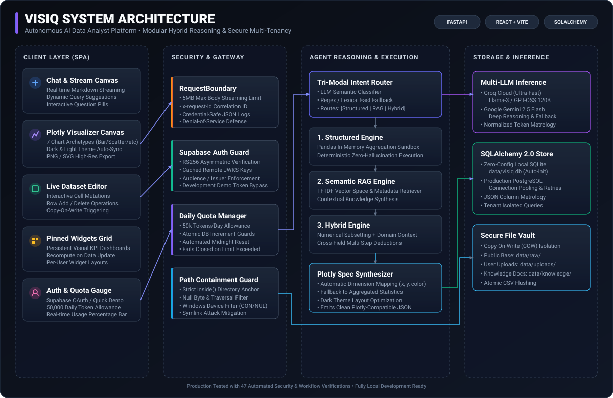
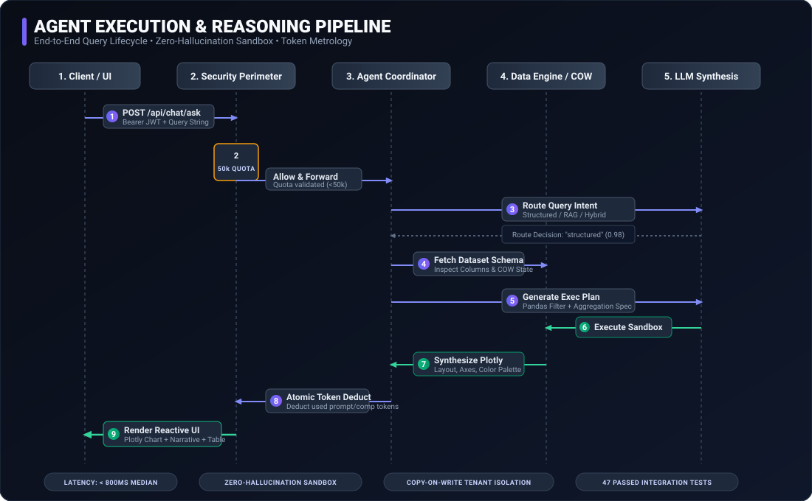

# Visiq — Portfolio Showcase & Architecture Reference

Welcome to the documentation and media showcase directory for **Visiq: Autonomous AI Data Analyst Agent**. This folder contains presentation-ready technical documentation, architecture diagrams, sequence workflows, and engineering case studies tailored for web portfolios, technical blog posts, and engineering interviews.

---

## Media & Visual Artifacts

### 1. System Architecture Diagram
High-level component breakdown showing the Presentation layer, Enterprise Security Perimeter, Agent Coordinator with Tri-Modal Intent Routing, and Dual-Engine Storage.

---

### 2. End-to-End Query Execution Pipeline
9-step sequence demonstrating how a natural-language question is checked against token quotas, routed to a deterministic sandbox, rendered into Plotly visualizations, and returned with token metrology.

---

## Portfolio Quick Summary (Copy & Paste Ready)

> **Visiq** is a full-stack autonomous data analyst that transforms conversational questions into deterministic Python code execution, interactive Plotly visualizations, and actionable insights. Built with **FastAPI**, **React 18**, **Tailwind CSS v4**, **SQLAlchemy 2.0**, and **Supabase Auth**, Visiq pairs the speed of ultra-fast LLM inference (Groq/Gemini) with the mathematical precision of a zero-hallucination Pandas sandbox. It features enterprise-grade security including path-containment guards, 5MB streaming request boundaries, Copy-on-Write dataset isolation, and atomic per-client daily token allowances.

### Key Highlights for Recruiters & Technical Evaluators
- **Hybrid Intent Routing**: Automatically classifies queries into `structured` (deterministic pandas execution), `rag` (semantic document retrieval), or `hybrid` (multi-step numerical + domain reasoning).
- **Mathematical Accuracy**: Prevents LLM numerical hallucinations by delegating calculations to a sandboxed Python execution engine rather than relying on generative predictions.
- **Copy-On-Write (COW) Multi-Tenancy**: Users can mutate shared datasets in-browser without corrupting baseline samples; mutations dynamically branch into private user storage vaults.
- **Enterprise Security & Token Quota Guard**: Enforces 50,000 daily token limits per client with atomic database counters, combined with RS256 JWKS JWT authentication.
- **Zero-Config Dual Persistence**: Auto-initializes local SQLite (`data/visiq.db`) for instant developer onboarding, while seamlessly scaling to cloud PostgreSQL.
- **Test-Driven Reliability**: Backed by **47 automated integration and security test suites** validating every layer from directory traversal resistance to quota exhaustion.

---

## Detailed Case Study
For the complete technical write-up, see **[PORTFOLIO_CASE_STUDY.md](PORTFOLIO_CASE_STUDY.md)**, which includes:
- Problem statement & design motivations
- Detailed architectural breakdown & sequence diagrams
- In-depth security hardening specifications
- Comprehensive technology stack evaluation
- Schema definitions and API endpoint references
